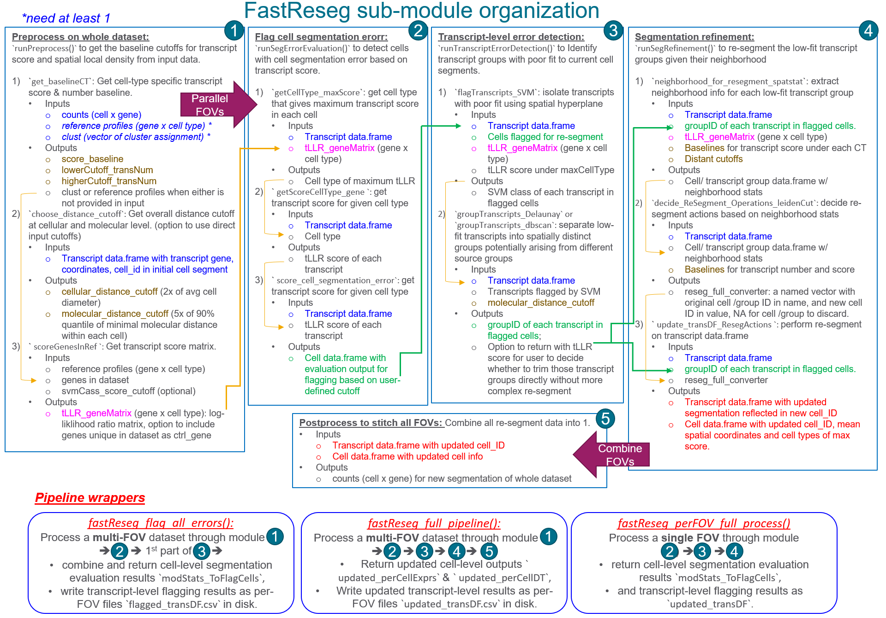

# FastReseg
 An R package for detection and correction of cell segmentation error based on spatial profile of transcripts
 
#### [Manuscript](https://www.nature.com/articles/s41598-025-08733-5):
 
Wu, L., Beechem, J.M. & Danaher, P. Using transcripts to refine image based cell segmentation with FastReseg. Sci Rep 15, 30508 (2025). https://doi.org/10.1038/s41598-025-08733-5
 
### Dev notes 
`FastReseg` package processes spatial transcriptome data through 5 different modules: 

* Preprocess on whole dataset

  1) `runPreprocess()` to get the baseline and cutoffs for transcript score and spatial local density from the whole dataset.

* Parallel processing on individual FOV: core wrapper `fastReseg_perFOV_full_process()` contains all the 3 modules in this step. 

  2) `runSegErrorEvaluation()` to detect cells with cell segmentation error based on spatial dependency of transcript score in a given transcript data.frame.
  3) `runTranscriptErrorDetection()` to identify transcript groups with poor fit to current cell segments. 
  4) `runSegRefinement()` to re-segment the low-fit transcript groups given their neighborhood.

* Combine outcomes from multiple FOVs into one

  5) Pipeline wrappers would combine resegmentation outputs from individual FOVs into one.

For convenience, two pipeline wrapper functions are included for streamline processing of multi-FOV dataset to different exit points.

- `fastReseg_flag_all_errors()`: performs preprocess and then evaluates and flags segmentation error in all input files, optional to return the gene expression matrix where all putative contaminating transcripts are trimmed from current cell segments.
- `fastReseg_full_pipeline()`: performs preprocess, detect and correct cell segmentation errors by trimming, splitting and merging given the local neighborhood of poor-fit transcript groups, can process multiple input files in parallel.   

### System requirements
- R (>= 3.5.0)
- UNIX, Mac or Windows
- see DESCRIPTION for full dependencies

### Demo
See the "vignettes" folder. 

- `tutorial.Rmd` and `tutorial.html` for example usages of streamline pipeline wrappers and modular functions for individual task.
- `a__flagErrorOnly_on_SMIobject.R` for flagging segmentation errors without correcting, interfacing `FastReseg` with SMI TAP pipeline (`Giotto`).
- `b__fastReseg_on_SMIobject.R` for runing entire resegmentation workfkow on a given dataset, example dataset, interfacing `FastReseg` with SMI TAP pipeline (`Giotto`).


### Workflow:



### Installation
#### Install the development version from GitHub
```
# to use with R 4.3.x
if(!requireNamespace("GiottoUtils", quietly=TRUE))
  remotes::install_github("drieslab/GiottoClass", upgrade="never", 
  ref = "bec3c79398a9aff299a01cc152ff6f2245a8f965")
  
if(!requireNamespace("GiottoClass", quietly=TRUE))
  remotes::install_github("drieslab/GiottoClass", upgrade="never", 
  ref = "6d9d385beebcc57b78d34ffbe30be1ef0a184681")
```
```
# install FastReseg from github
devtools::install_github("Nanostring-Biostats/FastReseg", 
                         build_vignettes = TRUE, ref = "main")
```
